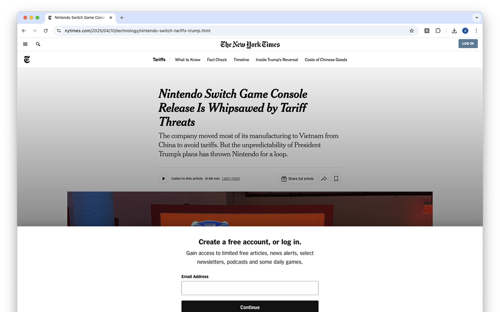
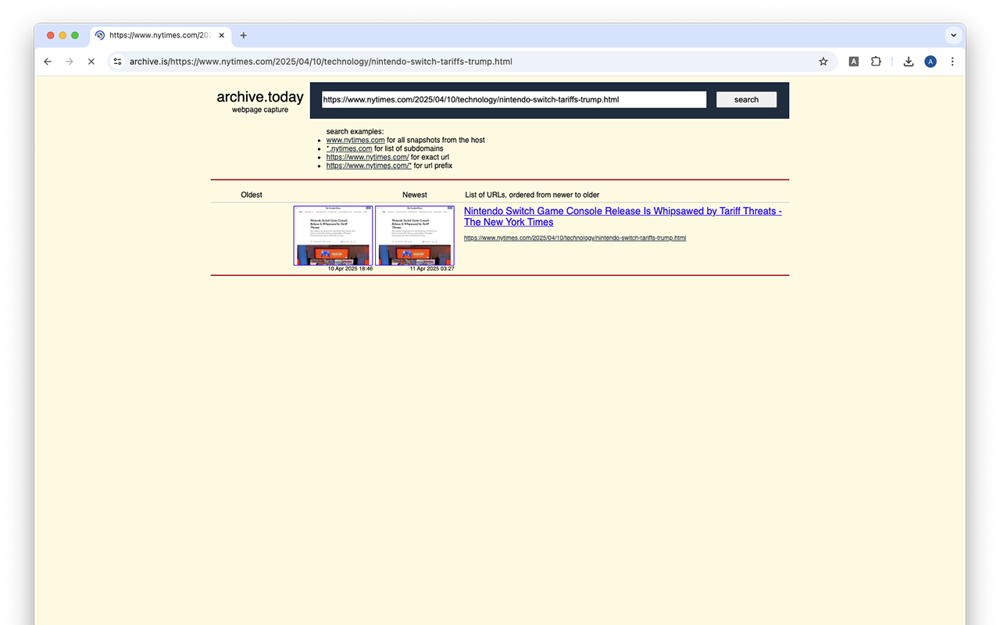

# Archive This!

**A simple, lightweight Chrome extension that instantly redirects your current tab to archive.is. Use it to save content before it changes, reference historical versions, or bypass paywalls and broken links. With just one click, you’ll have access to a permanent, archived copy of the page.**

No bloat. No tracking. Just a single click to preserve a web page forever or bypass paywalls.

---

## 🚀 Features

- 🧭 Redirects your current tab to [archive.is](https://archive.is)
- 🧼 No permissions beyond what’s required
- ⚡ Super fast — no UI or popup
- 🛡️ No background spying, analytics, or junk
- 🔧 Powered by Manifest V3 and a lightweight background script

---

## 📸 Preview

### 🔹 Original Page Behind a Paywall  

### 🔹 Click the Extension to Redirect to archive.is  

### 🔹 Archived Version — Paywall Removed  

---

## 🛠 Installation

### 🔗 Chrome Web Store

> [📦 Archive This! on the Chrome Web Store](https://chrome.google.com/webstore/detail/ARCHIVE_ID_HERE)

_Note to self: Replace `ARCHIVE_ID_HERE` when it's live._

---

### 🧪 Manual Install (for developers)

1. Clone this repo: git clone https://github.com/iamalexhoang/archive-this.git
2. Go to chrome://extensions
3. Enable Developer Mode
4. Click Load unpacked
5. Select the archive-this/ folder

### ⚙️ How It Works
- background.js listens for a click on the extension icon. When clicked:
- It gets the current tab URL and Redirects to: https://archive.today/?run=1&url=<current_tab_url>
- That’s it. No popup. No data stored.

### 📄 License
MIT License © 2025 Alex Hoang
See LICENSE for full terms.